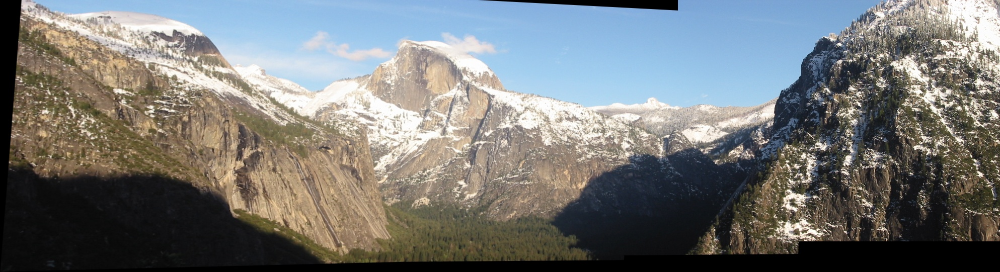
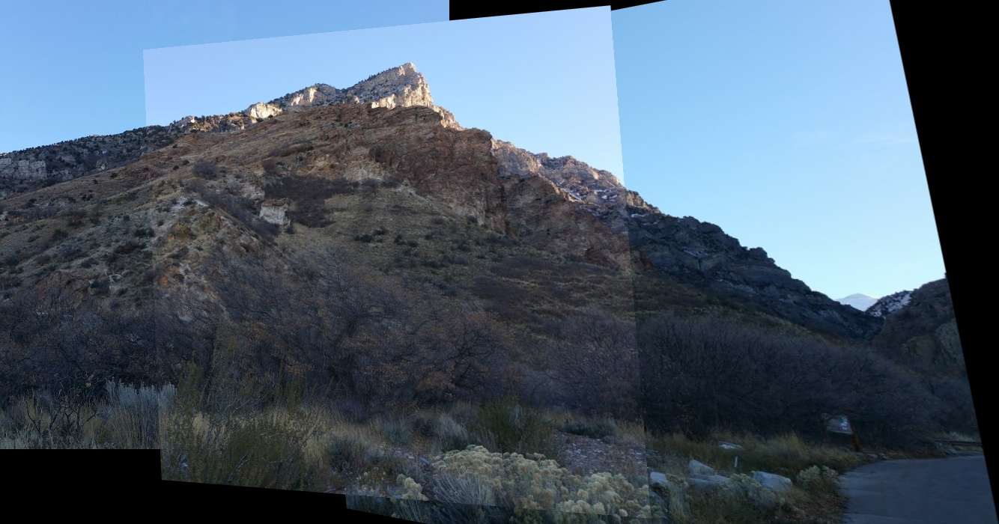
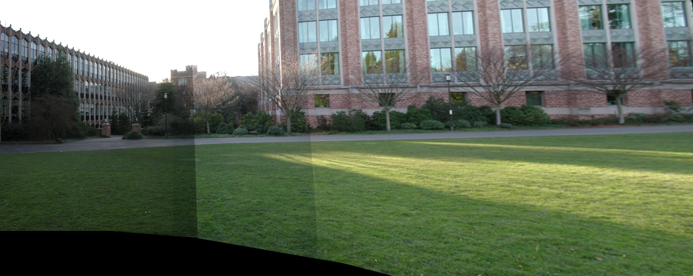
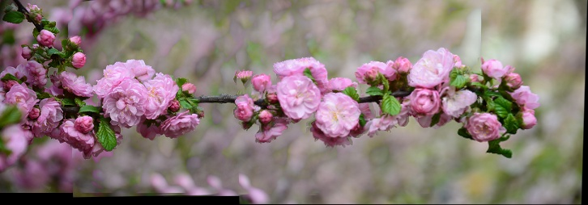

# Panorama Stitching from Scratch

Goal of this repo is to creates a Panorama from a set of images. The images may not be in order of apperences. This repo also contains code of Harris corner written from scratch. It compares SIFT and Harris features for image stitching. 

*Note: this code will not work for cylindrical panoramas*

## How to use

- Clone the repository by typing and Navigate to cloned directory  
  ```bash
  git clone https://github.com/take2rohit/Paronorama-Stitching.git
  cd Paronorama-Stitching
  ```
- Open [PanoramaStitching.py](PanoramaStitching.py) 
  - Change variable `root` to specify location of directory containg piecewise panoramaic images
  - Change `save_dir` to save the results of stitched panorama

## Using this repo as library

This is an extremely low code (4 lines) modular library to create panoramic images from a set of images. Just clone the repository in working code directory and run the below python code following commands

```python
from PanoramaStitching import Panorama

root = 'images/panorama_img/set3'

pan = Panorama(root)
stitchedIm = pan.createPanaroma(show_output=True)

```

For finer controls please see the docstrings of the code. 

## Results









## Contributers

- **Rohit Lal** - [Website](http://take2rohit.github.io/)
- **Khush Agrawal** - [Website](https://khush3.github.io/)

<!-- ## Tasks 

### For Harris Corner Detection

- [X] Basic Harris Detection Code
- [x] Implement Non Max Supression 

### For Panorama Stitching

- [ ] Implement Basic Image stitching for any number of images using OpenCV functions
  - [x] `Features`: Inbuilt SIFT features + SIFT descriptors 
  - [x] `Homography`: RANSAC (inbuilt)
  - [ ] `Blending`: Weighted transformed images
  - [x] `Features`: Compare with Harris features and SIFT features
  
- [ ] Crop panorama image
  - [x] Lossless cropping of black region without loosing image info
  - [ ] Lossy cropping of image with loosing some part of image 

## Scope for Optimization

- [ ] Faster searching for finding sequential images
- [ ] Automatic canvas shape detection
- [ ] Storing previous values H calculated and updating
- [ ] Storing and using harris and sift feature instead of re-computing
 -->
